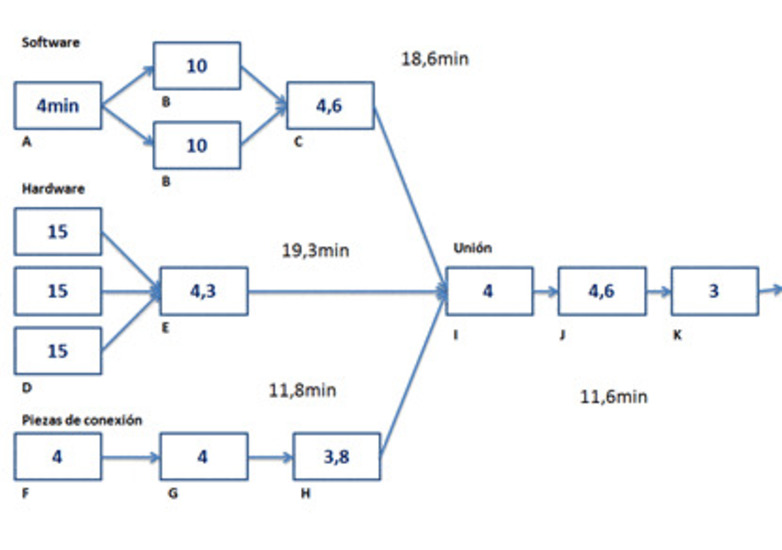

# Planteamiento del Problema

Una empresa de ensamblaje de equipos de computo desea saber si, basados en sus tiempos medios y su varianza por tarea. La inversión en el mejoramiento de la tarea *E* represeta un mejoramiento estadísticamente significativo que compense la inversión asociada. Ya que, con base en el diagrama la tarea *E* no se encuentra en la ruta crítcia.

Consideraciones iniciales:

- Se conoce los valores medios del tiempo y la varianza de realización de las tareas a ejecutar y que, cada tarea dentro del proceso se distribuye de forma normal.

- Se sabe que la ruta crítica está dada por la tareas: A, B, C, I, J, K

- Dado que niguna de las tareas es determinística es posible encontrar diferencias significativas para el proceso en general, ya que, puede hallarse que la distribución general del proceso se reajuste y genere un valor medio significativamente menor.

- De las tareas se conocen su distribución, valor medio y varianza. La nueva máquina para la tarea *E* tiene una distribución similar (normal) con un valor medio de 3.6 [min]. Para establecer un criterio del beneficio de la máquina se van a realizar 1000 simulaciones del proceso.

- Las tareas en paralelo son semejantes y cuentan con el mismo tiempo medio.

```{r message=FALSE}
# Librerías
library(magick)
library(knitr)
library(kableExtra)
library(tidyverse)
library(nortest)
library(car)
source("SimulacionProceso.R")
```


```{r setup, eval=TRUE, include=TRUE, out.width='80%', fig.cap= "*Nota*: el diagrama de proceso fue tomado del siguiente enlace: https://dharmacon.net/2023/07/05/descifrando-el-rendimiento-del-proyecto-con-el-diagrama-de-tiempo-de-ciclo/"}

# Formato png de la imagen
img <- image_read("diagrama_proceso.PNG")  
image_write(img, path = "diagrama_proceso.png", format = "png")

# Cargar imagen

```

```{r , warning=FALSE, include=TRUE}
#Data Frame
dfTiempoMedios <- data_frame(id_tarea = LETTERS[1:11], tiempo_medio = c(4, 10, 4.6, 15, 4.3, 4, 4, 3.8, 4, 4.6, 3), sd = c(1.9, 1.4, 2.0, 1.1, 2.1, 2.0, 2.2, 2.3, 3.0, 2.1, 2.7))

# Visualización de Tabla
dfTiempoMedios %>% 
  kable(format = "html", digits = 2, caption = "Tabla 1. Tiempos Medios de las Tareas", col.names = c('id Tarea', 'Tiempo Medio', 'Sd')) %>%
  kable_styling(full_width = FALSE, position = "center", font_size = 12) %>%
  column_spec(1, bold = FALSE) %>% 
  footnote(general_title = "Nota:", general = "algunas tareas se ejecutan en paralelo y tienen valores similares")

```


```{r}
# df del predecesor.
dfPredecesor <- data_frame(predecesor = c("A", "B", "C", "I", "J", "D", "E", "I", 
                                          "J", "F", "G", "H", "I", "J"), sucesor =
                             c("B", "C", "I", "J", "K", "E", "I", "J", "K", 
                               "G", "H", "I", "J", "K"))
# df del proceso.
library(truncnorm)


```

# Simulación

Para la generación de los valores pseudo-aleatorios normales se va a emplear un función de distribución truncada, ya que, en un proceso real los valores negativos no existen y es posible que los modelos normales generados entreguen valores negativos por lo que el límite inferior es cero. Para la prueba se realizan 1000 simulaciones.

Por probabilidad sabemos que: la suma de $n$ variables aleatorias con distribución normal e independientes se define como: 
$$S = X_1 + X_2 +... X_n$$
Por lo tanto, la nueva variable aleatoria $S$ sigue una distribución normal definida como:
$$S \thicksim N(\mu_S, \sigma_S)$$

## Simulación Escenario A

```{r}
# Fijar semilla 
#set.seed(3942)
set.seed(88329)
reps <- 1000

dfEscenarioA <- data_frame(escenario = rep("A", reps), salida = NA)

for(k in 1:reps){
  #df del proceso
  dfProceso <- data_frame(id = LETTERS[1:11], 
                          tiempo = rtruncnorm(n = 1, a = 0, b = Inf, 
                                              mean = dfTiempoMedios$tiempo_medio,
                                              sd = dfTiempoMedios$sd), 
                          estado = 0,
                          iniTiem = NA, 
                          finTiem = NA)
  dfEscenarioA$salida[k] <- SimulacionProceso(dfPoceso, dfPredecesor)
}

```

## Prueba de Hipótesis de Normalidad de la Salida del Proceso (Escenario A)

- $H_0$ Los tiempos de salida del proceso en el escenario A se distribuyen de forma normal.
- $H_1$ Los tiempos de salida del proceso en el escenario A no se distribuyen de forma normal.

```{r}
#Prueba de Normalidad Anderson-Darling
NormTestAD_A <- ad.test(dfEscenarioA$salida)
pValueAD_A <- NormTestAD_A[["p.value"]]
estadisticoAD_A <- NormTestAD_A[["statistic"]][["A"]]
```


Dado qué $p_{value}$ es mayor al nivel de significancia $\alpha$, $`r pValueAD_A` > 0.05$. Se concluye que se hacepta la hipótesis nula ($H_0$) de que los tiempos al final del proceso de ensamblaje de equipos de computo se distribuyen de forma normal.

## Simulación Escenario B

La máquina para la tarea E se estima que tiene un tiempo medio de 3.6 y desviación estandar de 2.

```{r}
# Fijar semilla 
#set.seed(3942)
set.seed(66456)
reps <- 1000

dfEscenarioB <- data_frame(escenario = rep("B", reps), salida = NA)
dfTiempoMedios[dfTiempoMedios$id_tarea == "E",c(2,3)] <- t(c(3.6, 2))

for(k in 1:reps){
  #df del proceso
  dfProceso <- data_frame(id = LETTERS[1:11], 
                          tiempo = rtruncnorm(n = 1, a = 0, b = Inf, 
                                              mean = dfTiempoMedios$tiempo_medio,
                                              sd = dfTiempoMedios$sd), 
                          estado = 0,
                          iniTiem = NA, 
                          finTiem = NA)
  dfEscenarioB$salida[k] <- SimulacionProceso(dfPoceso, dfPredecesor)
}

```

## Prueba de Hipótesis de Normalidad de la Salida del Proceso (Escenario B)

- $H_0$ Los tiempos de salida del proceso en el escenario B se distribuyen de forma normal.
- $H_1$ Los tiempos de salida del proceso en el escenario B no se distribuyen de forma normal.

```{r}
#Prueba de Normalidad Anderson-Darling
NormTestAD_B <- ad.test(dfEscenarioB$salida)
pValueAD_B <- NormTestAD_B[["p.value"]]
estadisticoAD_B <- NormTestAD_B[["statistic"]][["A"]]
```
Para el escenario B el $p_{value}$ es mayor al nivel de significancia $\alpha$, $`r pValueAD_B` > 0.05$ Por lo que no hay evidencia suficiente para rechazar la hipótesis nula $H_0$ de que los tiempos al final del proceso de ensamblaje de equipos de computo mejorando el tiempo de la tarea *E* se distribuyen de forma normal.

# Gráficas

## Gráfica Q-Q

```{r}
par(mfrow = c(1,2))
qqPlot(x = dfEscenarioA$salida, distribution = "norm", main = "Q-Q Escenario A", xlab = "Cuantiles Nomales", ylab = "Salida")
qqPlot(x = dfEscenarioB$salida, distribution = "norm", main = "Q-Q Escenario B", xlab = "Cuantiles Nomales", ylab = "Salida")

```

En ambos casos tanto para el escenario A como el B hay algunas discrepancias con la normal estandar en las colas de la distribución pero no interfiere con el tipo de análisis que buscamos realizar con la simulación,

## Histograma y Densidad

```{r}
# Df total
dfTotal <- rbind(dfEscenarioA, dfEscenarioB)

ggplot(dfTotal, aes(salida)) + 
  facet_wrap(~escenario, ncol = 1) + 
  geom_histogram(aes(y=..density..), colour = "black", fill = "white") + # ..density.. normaliza el histograma para compararlo con la densidad.
  geom_density(color = "blue", lwd = 1) +
  stat_function(fun = dnorm, args = list(mean= mean(dfEscenarioA$salida), sd= sd(dfEscenarioA$salida)), color = "red", linewidth = 0.7) +
  scale_color_manual(values = c("Distribución empírica" = "blue", "Distribución teórica" = "red")) +
  theme_light()
```

Con la distribución teórica (linea roja) con media y desviación estandar basada en los datos y la distribución empírica (linea azul), visualmente se puede considerar una distribución normalde los datos. Sin embargo, hay que considerar las demás pruebas tanto gráficas como pruebas normales, ya que, las pruebas gráficas están sujetas a los ajustes del kernel.

## Diagrama de Caja

```{r}
ggplot(dfTotal, aes(salida)) +
  facet_wrap(~escenario, ncol = 1) + 
  geom_boxplot() +
  theme_light()
```

Para ambos escenarios presenta unos puntos atípicos en concordancia con el q-q plot que muestra algunas discrepancias en las colas de los datos con la normal.

# Prueba de Hipótesis para Comparar Medias

## t-test Dos Muestras Independientes

Para probar la diferencia de medias de los escenarios A y B se plantean las siguientes hipótesis estadísticas:
- $H_0$: no hay diferencias significativas entre las medias de cada escenario $\mu_A = \mu_B$ o lo que es equivalente $\mu_A - \mu_B = 0$.
- $H_1$: ambas medias son significativamente distintas.

```{r}
t.test(dfEscenarioA$salida, dfEscenarioB$salida, var.equal = FALSE)
```

Dado que, el $p_{value}$ es mayor que el nivel de significancia $\alpha$, $0.8346 > 0.05$. Se concluye que ambas medias son estadísticamente iguales, por que no hay diferencias significativas que el mejoramiento de la tarea *E* contribuya al mejoramiento del proceso en general.

# ANOVA de Una Vía para Datos Independientes

La fomulación de hipótesis es similar a la prueba *t*.

```{r}
summary(aov(salida ~ escenario, dfTotal))
```

Los resultados para el anova de un solo factor y dos grupo $p_{value}=0.835$ es similar a la prueba *t*, ya que, esta última es un caso particular del ANOVA y se aplica para solo dos grupos de un solo factor.

# Conclusiones y Consideraciones Finales

Para las simulaciones no se estimó el tamaño de la muestra, se realizaron 1000 simulaciones por cada escenario. La decisión de dicho número de simulaciones es totalmente arbitrario y considerar no tardar mucho tiempo en cada corrida.
Para el escenario A se fija la semilla, emulando que esos datos ya han sucedido, son conocidos. Sin embargo, para el escenario B se supone que las corridas deben ser aleatorias (pseudoaleatorias), se fijó igual la semilla por la siguiente razone: las pruebas formales a medida que el tamaño de muestra es muy grande (>1000) se hacen más suceptibles a pequeñas variaciones por lo que en algunas corridas las pruebas formales sugieren que la distribución no es normal por ende se fijó una semilla y las pruebas arrojan normalidad. Sin embargo, al realizar pruebas gráficas para identificar las discrepancias se hallan valores atípicos en las colas pero para el análisis no se consideran impedimento para continuar. 
Se concluye que las diferencias entre no mejorar y mejorar la tarea *E*, escenario A y B respectivamente, no generar diferencias significativas en el procesos en general, no representaría una mejora sustancial para realizar dicha inversión.


